# System Flows - Complete Reference

## Table of Contents

1. [Authentication Flows](#1-authentication-flows)
2. [Certificate Creation Flow](#2-certificate-creation-flow)
3. [Certificate Submission & Review Flow](#3-certificate-submission--review-flow)
4. [Unlock Request Flow](#4-unlock-request-flow)
5. [Customer Review Flow](#5-customer-review-flow)
6. [Admin Authorization Flow](#6-admin-authorization-flow)
7. [Chat & Messaging Flow](#7-chat--messaging-flow)
8. [Notification Flow](#8-notification-flow)
9. [User Management Flow](#9-user-management-flow)
10. [Customer Registration Flow](#10-customer-registration-flow)
11. [Instrument Management Flow](#11-instrument-management-flow)
12. [PDF Generation & Signing Flow](#12-pdf-generation--signing-flow)
13. [API Reference - Complete](#13-api-reference---complete)
14. [Scripts & Commands](#14-scripts--commands)
15. [CI/CD Pipeline](#15-cicd-pipeline)
16. [Production Deployment](#16-production-deployment)
17. [Database Operations](#17-database-operations)

---

# 1. Authentication Flows

## 1.1 Staff Login Flow

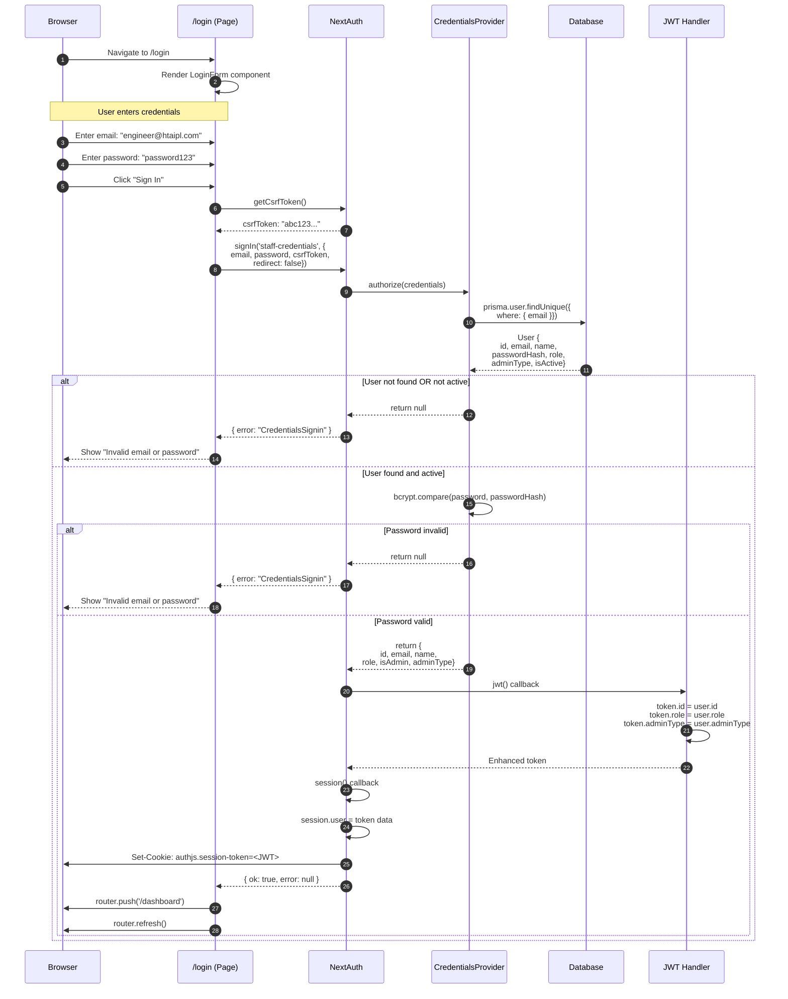
```mermaid
sequenceDiagram
    autonumber
    participant B as Browser
    participant LP as /login (Page)
    participant NA as NextAuth
    participant CP as CredentialsProvider
    participant DB as Database
    participant JWT as JWT Handler

    B->>LP: Navigate to /login
    LP->>LP: Render LoginForm component

    Note over B,LP: User enters credentials
    B->>LP: Enter email: "engineer@htaipl.com"
    B->>LP: Enter password: "password123"
    B->>LP: Click "Sign In"

    LP->>NA: getCsrfToken()
    NA-->>LP: csrfToken: "abc123..."

    LP->>NA: signIn('staff-credentials', {<br/>email, password, csrfToken,<br/>redirect: false})

    NA->>CP: authorize(credentials)

    CP->>DB: prisma.user.findUnique({<br/>where: { email }})
    DB-->>CP: User {<br/>id, email, name,<br/>passwordHash, role,<br/>adminType, isActive}

    alt User not found OR not active
        CP-->>NA: return null
        NA-->>LP: { error: "CredentialsSignin" }
        LP-->>B: Show "Invalid email or password"
    else User found and active
        CP->>CP: bcrypt.compare(password, passwordHash)

        alt Password invalid
            CP-->>NA: return null
            NA-->>LP: { error: "CredentialsSignin" }
            LP-->>B: Show "Invalid email or password"
        else Password valid
            CP-->>NA: return {<br/>id, email, name,<br/>role, isAdmin, adminType}

            NA->>JWT: jwt() callback
            JWT->>JWT: token.id = user.id<br/>token.role = user.role<br/>token.adminType = user.adminType
            JWT-->>NA: Enhanced token

            NA->>NA: session() callback
            NA->>NA: session.user = token data

            NA->>B: Set-Cookie: authjs.session-token=<JWT>
            NA-->>LP: { ok: true, error: null }

            LP->>B: router.push('/dashboard')
            LP->>B: router.refresh()
        end
    end
```

### Staff Login - API Details

**Endpoint**: `POST /api/auth/callback/staff-credentials`

**Request Body** (form-urlencoded):
```
email=engineer@htaipl.com
password=password123
csrfToken=abc123...
```

**Database Query**:
```typescript
const user = await prisma.user.findUnique({
  where: { email: credentials.email }
})
```

**Success Response**: Sets cookie `authjs.session-token`

**JWT Token Contents**:
```json
{
  "id": "clx123...",
  "email": "engineer@htaipl.com",
  "name": "Test Engineer",
  "role": "ENGINEER",
  "isAdmin": false,
  "adminType": null,
  "iat": 1234567890,
  "exp": 1234654290
}
```

---

## 1.2 Customer Login Flow

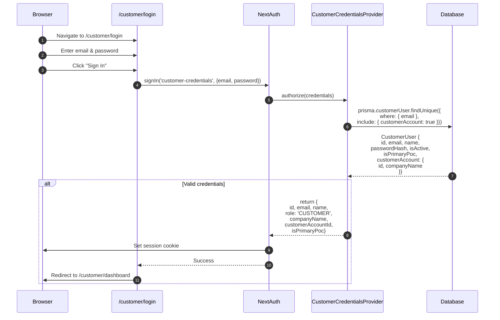
```mermaid
sequenceDiagram
    autonumber
    participant B as Browser
    participant LP as /customer/login
    participant NA as NextAuth
    participant CP as CustomerCredentialsProvider
    participant DB as Database

    B->>LP: Navigate to /customer/login
    B->>LP: Enter email & password
    B->>LP: Click "Sign In"

    LP->>NA: signIn('customer-credentials', {email, password})

    NA->>CP: authorize(credentials)

    CP->>DB: prisma.customerUser.findUnique({<br/>where: { email },<br/>include: { customerAccount: true }})

    DB-->>CP: CustomerUser {<br/>id, email, name,<br/>passwordHash, isActive,<br/>isPrimaryPoc,<br/>customerAccount: {<br/>  id, companyName<br/>}}

    alt Valid credentials
        CP-->>NA: return {<br/>id, email, name,<br/>role: 'CUSTOMER',<br/>companyName,<br/>customerAccountId,<br/>isPrimaryPoc}

        NA->>B: Set session cookie
        NA-->>LP: Success
        LP->>B: Redirect to /customer/dashboard
    end
```

### Customer Login - API Details

**Endpoint**: `POST /api/auth/callback/customer-credentials`

**Database Query**:
```typescript
const customerUser = await prisma.customerUser.findUnique({
  where: { email: credentials.email },
  include: { customerAccount: true }
})
```

**JWT Token Contents (Customer)**:
```json
{
  "id": "clx456...",
  "email": "customer@acme.com",
  "name": "John Customer",
  "role": "CUSTOMER",
  "companyName": "Acme Industries",
  "customerAccountId": "clx789...",
  "isPrimaryPoc": true
}
```

---

## 1.3 Session Validation in API Routes

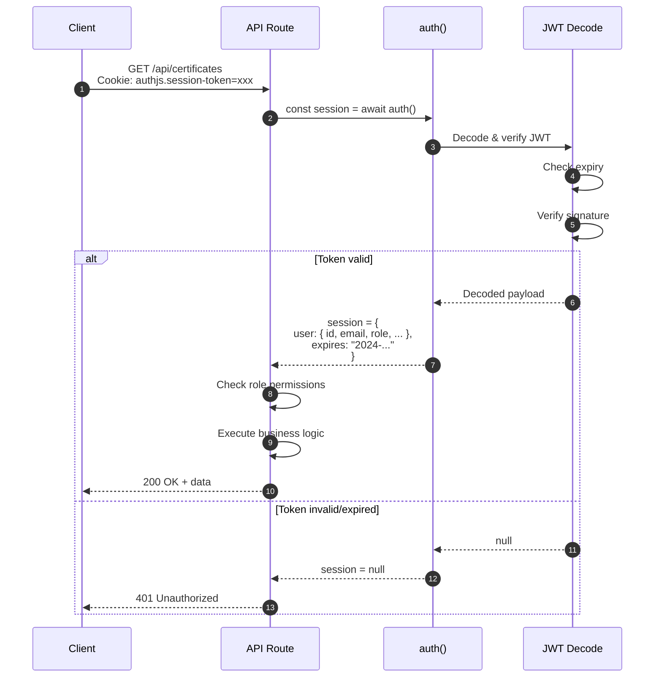
```mermaid
sequenceDiagram
    autonumber
    participant C as Client
    participant API as API Route
    participant Auth as auth()
    participant JWT as JWT Decode

    C->>API: GET /api/certificates<br/>Cookie: authjs.session-token=xxx

    API->>Auth: const session = await auth()
    Auth->>JWT: Decode & verify JWT
    JWT->>JWT: Check expiry
    JWT->>JWT: Verify signature

    alt Token valid
        JWT-->>Auth: Decoded payload
        Auth-->>API: session = {<br/>user: { id, email, role, ... },<br/>expires: "2024-..."<br/>}

        API->>API: Check role permissions
        API->>API: Execute business logic
        API-->>C: 200 OK + data
    else Token invalid/expired
        JWT-->>Auth: null
        Auth-->>API: session = null
        API-->>C: 401 Unauthorized
    end
```

---

## 1.4 Middleware Route Protection

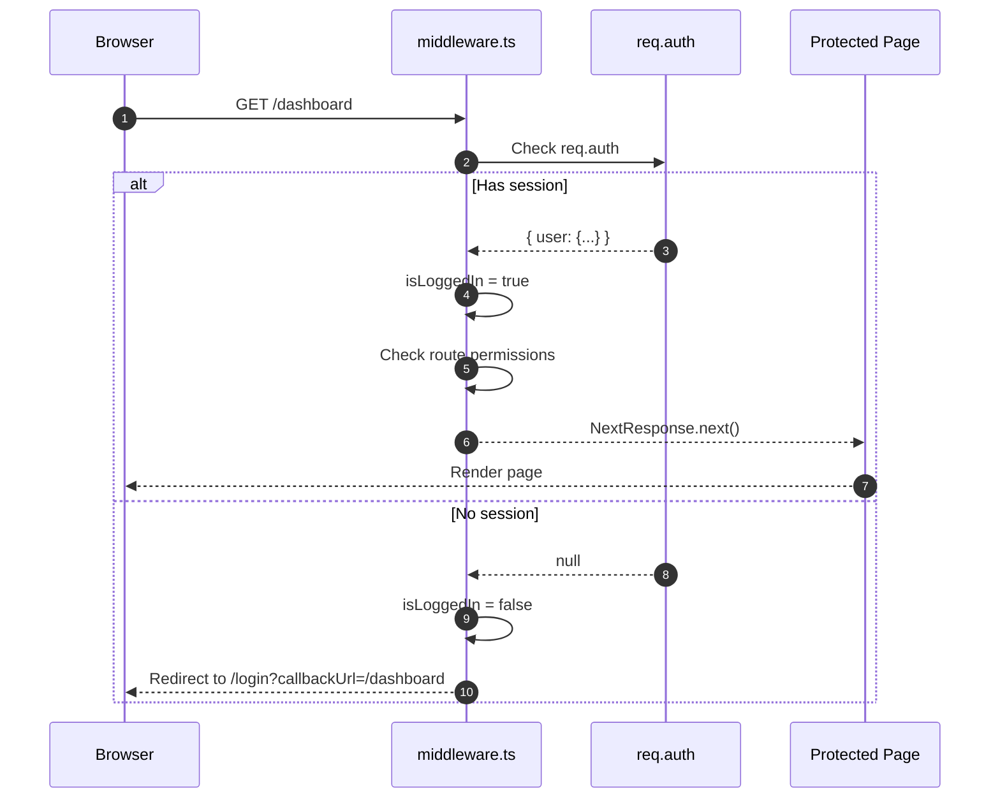
```mermaid
sequenceDiagram
    autonumber
    participant B as Browser
    participant MW as middleware.ts
    participant Auth as req.auth
    participant Page as Protected Page

    B->>MW: GET /dashboard

    MW->>Auth: Check req.auth

    alt Has session
        Auth-->>MW: { user: {...} }
        MW->>MW: isLoggedIn = true
        MW->>MW: Check route permissions
        MW-->>Page: NextResponse.next()
        Page-->>B: Render page
    else No session
        Auth-->>MW: null
        MW->>MW: isLoggedIn = false
        MW-->>B: Redirect to /login?callbackUrl=/dashboard
    end
```

**middleware.ts location**: `src/middleware.ts`

**Protected Routes**:
- `/dashboard/*` - Staff only
- `/certificates/*` - Staff only
- `/admin/*` - Admin only
- `/customer/dashboard` - Customer only
- `/review/*` - Staff only

**Public Routes**:
- `/login`
- `/customer/login`
- `/customer/register`
- `/api/health`
- `/api/auth/*`

---

# 2. Certificate Creation Flow

## 2.1 Open New Certificate Form

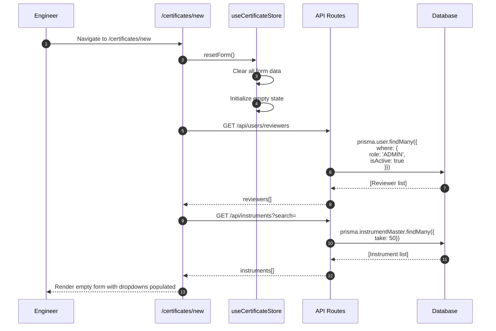
```mermaid
sequenceDiagram
    autonumber
    participant E as Engineer
    participant FE as /certificates/new
    participant Store as useCertificateStore
    participant API as API Routes
    participant DB as Database

    E->>FE: Navigate to /certificates/new

    FE->>Store: resetForm()
    Store->>Store: Clear all form data
    Store->>Store: Initialize empty state

    FE->>API: GET /api/users/reviewers
    API->>DB: prisma.user.findMany({<br/>where: {<br/>  role: 'ADMIN',<br/>  isActive: true<br/>}})
    DB-->>API: [Reviewer list]
    API-->>FE: reviewers[]

    FE->>API: GET /api/instruments?search=
    API->>DB: prisma.instrumentMaster.findMany({<br/>take: 50})
    DB-->>API: [Instrument list]
    API-->>FE: instruments[]

    FE-->>E: Render empty form with dropdowns populated
```

---

## 2.2 Fill Certificate Form - Step by Step

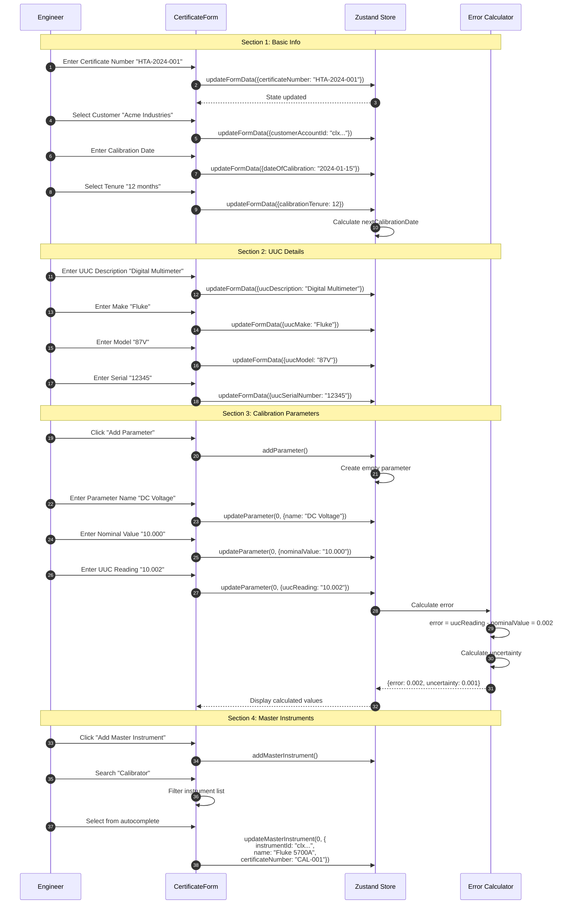
```mermaid
sequenceDiagram
    autonumber
    participant E as Engineer
    participant Form as CertificateForm
    participant Store as Zustand Store
    participant Calc as Error Calculator

    Note over E,Calc: Section 1: Basic Info
    E->>Form: Enter Certificate Number "HTA-2024-001"
    Form->>Store: updateFormData({certificateNumber: "HTA-2024-001"})
    Store-->>Form: State updated

    E->>Form: Select Customer "Acme Industries"
    Form->>Store: updateFormData({customerAccountId: "clx..."})

    E->>Form: Enter Calibration Date
    Form->>Store: updateFormData({dateOfCalibration: "2024-01-15"})

    E->>Form: Select Tenure "12 months"
    Form->>Store: updateFormData({calibrationTenure: 12})
    Store->>Store: Calculate nextCalibrationDate

    Note over E,Calc: Section 2: UUC Details
    E->>Form: Enter UUC Description "Digital Multimeter"
    Form->>Store: updateFormData({uucDescription: "Digital Multimeter"})

    E->>Form: Enter Make "Fluke"
    Form->>Store: updateFormData({uucMake: "Fluke"})

    E->>Form: Enter Model "87V"
    Form->>Store: updateFormData({uucModel: "87V"})

    E->>Form: Enter Serial "12345"
    Form->>Store: updateFormData({uucSerialNumber: "12345"})

    Note over E,Calc: Section 3: Calibration Parameters
    E->>Form: Click "Add Parameter"
    Form->>Store: addParameter()
    Store->>Store: Create empty parameter

    E->>Form: Enter Parameter Name "DC Voltage"
    Form->>Store: updateParameter(0, {name: "DC Voltage"})

    E->>Form: Enter Nominal Value "10.000"
    Form->>Store: updateParameter(0, {nominalValue: "10.000"})

    E->>Form: Enter UUC Reading "10.002"
    Form->>Store: updateParameter(0, {uucReading: "10.002"})

    Store->>Calc: Calculate error
    Calc->>Calc: error = uucReading - nominalValue = 0.002
    Calc->>Calc: Calculate uncertainty
    Calc-->>Store: {error: 0.002, uncertainty: 0.001}
    Store-->>Form: Display calculated values

    Note over E,Calc: Section 4: Master Instruments
    E->>Form: Click "Add Master Instrument"
    Form->>Store: addMasterInstrument()

    E->>Form: Search "Calibrator"
    Form->>Form: Filter instrument list
    E->>Form: Select from autocomplete
    Form->>Store: updateMasterInstrument(0, {<br/>instrumentId: "clx...",<br/>name: "Fluke 5700A",<br/>certificateNumber: "CAL-001"})
```

### Zustand Store State Structure

```typescript
// useCertificateStore state
{
  formData: {
    certificateNumber: "HTA-2024-001",
    customerAccountId: "clx...",
    customerName: "Acme Industries",
    dateOfCalibration: "2024-01-15",
    calibrationTenure: 12,
    nextCalibrationDate: "2025-01-15",
    uucDescription: "Digital Multimeter",
    uucMake: "Fluke",
    uucModel: "87V",
    uucSerialNumber: "12345",
    // ... more fields
  },
  parameters: [
    {
      id: "temp-1",
      name: "DC Voltage",
      unit: "V",
      nominalValue: "10.000",
      uucReading: "10.002",
      error: 0.002,
      uncertainty: 0.001,
      acceptanceCriteria: "±0.01",
      result: "PASS"
    }
  ],
  masterInstruments: [
    {
      id: "temp-1",
      instrumentId: "clx...",
      name: "Fluke 5700A",
      make: "Fluke",
      model: "5700A",
      serialNumber: "CAL-001",
      certificateNumber: "CERT-001",
      validUntil: "2025-06-01"
    }
  ],
  uucImages: [],
  isDirty: true,
  isValid: true
}
```

---

## 2.3 Save Certificate Draft

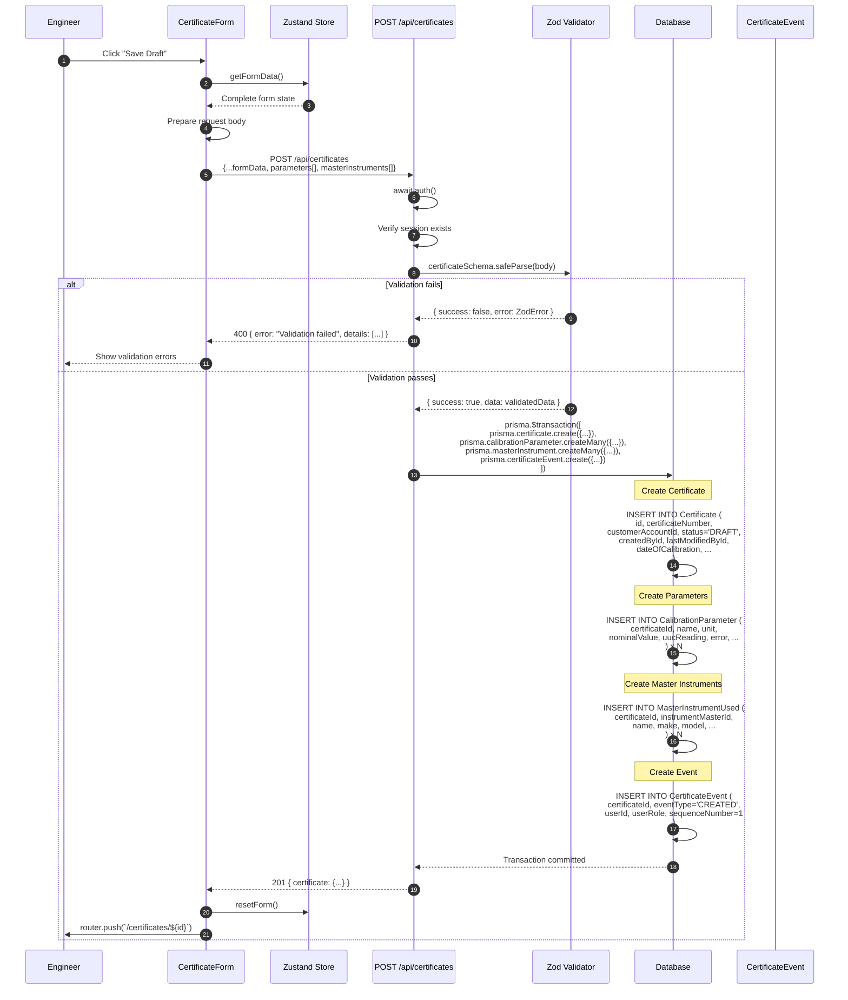
```mermaid
sequenceDiagram
    autonumber
    participant E as Engineer
    participant Form as CertificateForm
    participant Store as Zustand Store
    participant API as POST /api/certificates
    participant Val as Zod Validator
    participant DB as Database
    participant Event as CertificateEvent

    E->>Form: Click "Save Draft"
    Form->>Store: getFormData()
    Store-->>Form: Complete form state

    Form->>Form: Prepare request body
    Form->>API: POST /api/certificates<br/>{...formData, parameters[], masterInstruments[]}

    API->>API: await auth()
    API->>API: Verify session exists

    API->>Val: certificateSchema.safeParse(body)

    alt Validation fails
        Val-->>API: { success: false, error: ZodError }
        API-->>Form: 400 { error: "Validation failed", details: [...] }
        Form-->>E: Show validation errors
    else Validation passes
        Val-->>API: { success: true, data: validatedData }

        API->>DB: prisma.$transaction([<br/>  prisma.certificate.create({...}),<br/>  prisma.calibrationParameter.createMany({...}),<br/>  prisma.masterInstrument.createMany({...}),<br/>  prisma.certificateEvent.create({...})<br/>])

        Note over DB: Create Certificate
        DB->>DB: INSERT INTO Certificate (<br/>  id, certificateNumber,<br/>  customerAccountId, status='DRAFT',<br/>  createdById, lastModifiedById,<br/>  dateOfCalibration, ...<br/>)

        Note over DB: Create Parameters
        DB->>DB: INSERT INTO CalibrationParameter (<br/>  certificateId, name, unit,<br/>  nominalValue, uucReading, error, ...<br/>) x N

        Note over DB: Create Master Instruments
        DB->>DB: INSERT INTO MasterInstrumentUsed (<br/>  certificateId, instrumentMasterId,<br/>  name, make, model, ...<br/>) x N

        Note over DB: Create Event
        DB->>DB: INSERT INTO CertificateEvent (<br/>  certificateId, eventType='CREATED',<br/>  userId, userRole, sequenceNumber=1<br/>)

        DB-->>API: Transaction committed
        API-->>Form: 201 { certificate: {...} }

        Form->>Store: resetForm()
        Form->>E: router.push(`/certificates/${id}`)
    end
```

### Save Certificate - API Details

**Endpoint**: `POST /api/certificates`

**Request Body**:
```json
{
  "certificateNumber": "HTA-2024-001",
  "customerAccountId": "clx123...",
  "dateOfCalibration": "2024-01-15",
  "calibrationTenure": 12,
  "uucDescription": "Digital Multimeter",
  "uucMake": "Fluke",
  "uucModel": "87V",
  "uucSerialNumber": "12345",
  "parameters": [
    {
      "name": "DC Voltage",
      "unit": "V",
      "nominalValue": "10.000",
      "uucReading": "10.002",
      "error": 0.002,
      "uncertainty": 0.001,
      "acceptanceCriteria": "±0.01",
      "result": "PASS"
    }
  ],
  "masterInstruments": [
    {
      "instrumentMasterId": "clx456...",
      "name": "Fluke 5700A",
      "certificateNumber": "CAL-001"
    }
  ]
}
```

**Response (201 Created)**:
```json
{
  "id": "clx789...",
  "certificateNumber": "HTA-2024-001",
  "status": "DRAFT",
  "createdAt": "2024-01-15T10:00:00Z",
  "createdBy": {
    "id": "clx...",
    "name": "Test Engineer"
  }
}
```

**Database State After Save**:
```
Certificate: status=DRAFT, currentRevision=0
CertificateEvent: eventType=CREATED, sequenceNumber=1
CalibrationParameter: [N rows linked to certificate]
MasterInstrumentUsed: [N rows linked to certificate]
```

---

## 2.4 Upload UUC Images

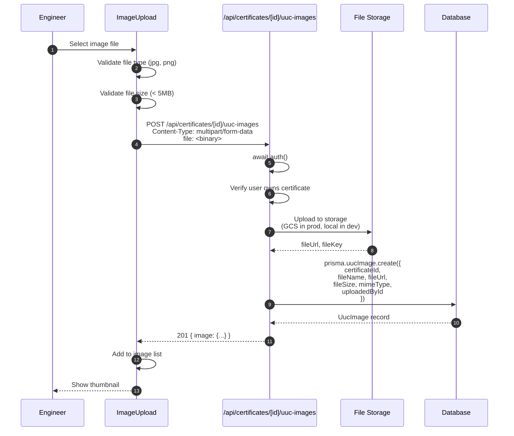
```mermaid
sequenceDiagram
    autonumber
    participant E as Engineer
    participant Form as ImageUpload
    participant API as /api/certificates/[id]/uuc-images
    participant Store as File Storage
    participant DB as Database

    E->>Form: Select image file
    Form->>Form: Validate file type (jpg, png)
    Form->>Form: Validate file size (< 5MB)

    Form->>API: POST /api/certificates/[id]/uuc-images<br/>Content-Type: multipart/form-data<br/>file: <binary>

    API->>API: await auth()
    API->>API: Verify user owns certificate

    API->>Store: Upload to storage<br/>(GCS in prod, local in dev)
    Store-->>API: fileUrl, fileKey

    API->>DB: prisma.uucImage.create({<br/>  certificateId,<br/>  fileName, fileUrl,<br/>  fileSize, mimeType,<br/>  uploadedById<br/>})
    DB-->>API: UucImage record

    API-->>Form: 201 { image: {...} }
    Form->>Form: Add to image list
    Form-->>E: Show thumbnail
```

**Endpoint**: `POST /api/certificates/[id]/uuc-images`

**Request**: `multipart/form-data` with `file` field

**Response**:
```json
{
  "id": "clx...",
  "fileName": "multimeter-front.jpg",
  "fileUrl": "/api/certificates/xxx/uuc-images/yyy/file",
  "fileSize": 245678,
  "mimeType": "image/jpeg",
  "uploadedAt": "2024-01-15T10:05:00Z"
}
```

---

# 3. Certificate Submission & Review Flow

## 3.1 Submit Certificate for Review

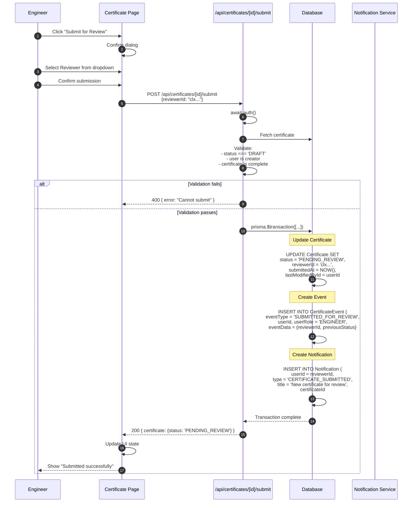
```mermaid
sequenceDiagram
    autonumber
    participant E as Engineer
    participant FE as Certificate Page
    participant API as /api/certificates/[id]/submit
    participant DB as Database
    participant Notif as Notification Service

    E->>FE: Click "Submit for Review"
    FE->>FE: Confirm dialog

    E->>FE: Select Reviewer from dropdown
    E->>FE: Confirm submission

    FE->>API: POST /api/certificates/[id]/submit<br/>{reviewerId: "clx..."}

    API->>API: await auth()
    API->>DB: Fetch certificate

    API->>API: Validate:<br/>- status === 'DRAFT'<br/>- user is creator<br/>- certificate is complete

    alt Validation fails
        API-->>FE: 400 { error: "Cannot submit" }
    else Validation passes
        API->>DB: prisma.$transaction([...])

        Note over DB: Update Certificate
        DB->>DB: UPDATE Certificate SET<br/>  status = 'PENDING_REVIEW',<br/>  reviewerId = 'clx...',<br/>  submittedAt = NOW(),<br/>  lastModifiedById = userId

        Note over DB: Create Event
        DB->>DB: INSERT INTO CertificateEvent (<br/>  eventType = 'SUBMITTED_FOR_REVIEW',<br/>  userId, userRole = 'ENGINEER',<br/>  eventData = {reviewerId, previousStatus}<br/>)

        Note over DB: Create Notification
        DB->>DB: INSERT INTO Notification (<br/>  userId = reviewerId,<br/>  type = 'CERTIFICATE_SUBMITTED',<br/>  title = 'New certificate for review',<br/>  certificateId<br/>)

        DB-->>API: Transaction complete
        API-->>FE: 200 { certificate: {status: 'PENDING_REVIEW'} }
        FE->>FE: Update UI state
        FE-->>E: Show "Submitted successfully"
    end
```

**Endpoint**: `POST /api/certificates/[id]/submit`

**Request Body**:
```json
{
  "reviewerId": "clx123..."
}
```

**Database Changes**:
```sql
-- Certificate
UPDATE "Certificate"
SET status = 'PENDING_REVIEW',
    "reviewerId" = 'clx123...',
    "submittedAt" = NOW()
WHERE id = 'xxx';

-- Event
INSERT INTO "CertificateEvent" (
  "certificateId", "eventType", "userId",
  "userRole", "eventData", "sequenceNumber"
) VALUES (
  'xxx', 'SUBMITTED_FOR_REVIEW', 'engineer-id',
  'ENGINEER', '{"reviewerId": "clx123...", "previousStatus": "DRAFT"}', 2
);

-- Notification
INSERT INTO "Notification" (
  "userId", "type", "title", "message", "certificateId"
) VALUES (
  'clx123...', 'CERTIFICATE_SUBMITTED',
  'New certificate for review',
  'Certificate HTA-2024-001 submitted by Test Engineer',
  'xxx'
);
```

---

## 3.2 Reviewer Opens Review Queue

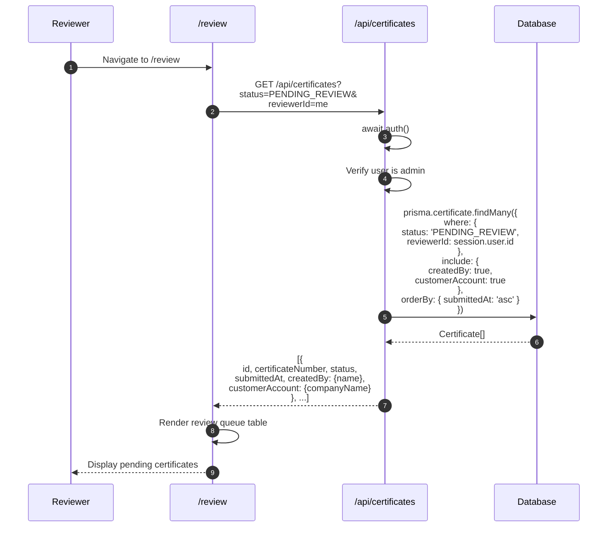
```mermaid
sequenceDiagram
    autonumber
    participant R as Reviewer
    participant FE as /review
    participant API as /api/certificates
    participant DB as Database

    R->>FE: Navigate to /review

    FE->>API: GET /api/certificates?<br/>status=PENDING_REVIEW&<br/>reviewerId=me

    API->>API: await auth()
    API->>API: Verify user is admin

    API->>DB: prisma.certificate.findMany({<br/>  where: {<br/>    status: 'PENDING_REVIEW',<br/>    reviewerId: session.user.id<br/>  },<br/>  include: {<br/>    createdBy: true,<br/>    customerAccount: true<br/>  },<br/>  orderBy: { submittedAt: 'asc' }<br/>})

    DB-->>API: Certificate[]

    API-->>FE: [{<br/>  id, certificateNumber, status,<br/>  submittedAt, createdBy: {name},<br/>  customerAccount: {companyName}<br/>}, ...]

    FE->>FE: Render review queue table
    FE-->>R: Display pending certificates
```

---

## 3.3 Review Certificate - Approve

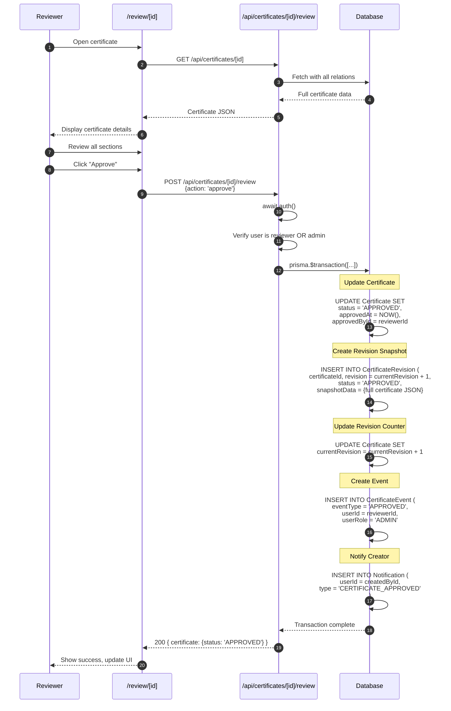
```mermaid
sequenceDiagram
    autonumber
    participant R as Reviewer
    participant FE as /review/[id]
    participant API as /api/certificates/[id]/review
    participant DB as Database

    R->>FE: Open certificate
    FE->>API: GET /api/certificates/[id]
    API->>DB: Fetch with all relations
    DB-->>API: Full certificate data
    API-->>FE: Certificate JSON
    FE-->>R: Display certificate details

    R->>FE: Review all sections
    R->>FE: Click "Approve"

    FE->>API: POST /api/certificates/[id]/review<br/>{action: 'approve'}

    API->>API: await auth()
    API->>API: Verify user is reviewer OR admin

    API->>DB: prisma.$transaction([...])

    Note over DB: Update Certificate
    DB->>DB: UPDATE Certificate SET<br/>  status = 'APPROVED',<br/>  approvedAt = NOW(),<br/>  approvedById = reviewerId

    Note over DB: Create Revision Snapshot
    DB->>DB: INSERT INTO CertificateRevision (<br/>  certificateId, revision = currentRevision + 1,<br/>  status = 'APPROVED',<br/>  snapshotData = {full certificate JSON}<br/>)

    Note over DB: Update Revision Counter
    DB->>DB: UPDATE Certificate SET<br/>  currentRevision = currentRevision + 1

    Note over DB: Create Event
    DB->>DB: INSERT INTO CertificateEvent (<br/>  eventType = 'APPROVED',<br/>  userId = reviewerId,<br/>  userRole = 'ADMIN'<br/>)

    Note over DB: Notify Creator
    DB->>DB: INSERT INTO Notification (<br/>  userId = createdById,<br/>  type = 'CERTIFICATE_APPROVED'<br/>)

    DB-->>API: Transaction complete
    API-->>FE: 200 { certificate: {status: 'APPROVED'} }
    FE-->>R: Show success, update UI
```

---

## 3.4 Review Certificate - Request Revision

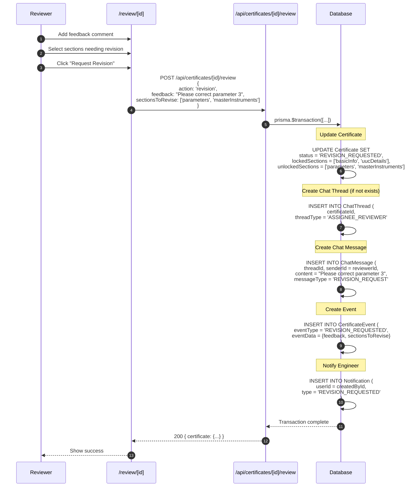
```mermaid
sequenceDiagram
    autonumber
    participant R as Reviewer
    participant FE as /review/[id]
    participant API as /api/certificates/[id]/review
    participant DB as Database

    R->>FE: Add feedback comment
    R->>FE: Select sections needing revision
    R->>FE: Click "Request Revision"

    FE->>API: POST /api/certificates/[id]/review<br/>{<br/>  action: 'revision',<br/>  feedback: "Please correct parameter 3",<br/>  sectionsToRevise: ['parameters', 'masterInstruments']<br/>}

    API->>DB: prisma.$transaction([...])

    Note over DB: Update Certificate
    DB->>DB: UPDATE Certificate SET<br/>  status = 'REVISION_REQUESTED',<br/>  lockedSections = ['basicInfo', 'uucDetails'],<br/>  unlockedSections = ['parameters', 'masterInstruments']

    Note over DB: Create Chat Thread (if not exists)
    DB->>DB: INSERT INTO ChatThread (<br/>  certificateId,<br/>  threadType = 'ASSIGNEE_REVIEWER'<br/>)

    Note over DB: Create Chat Message
    DB->>DB: INSERT INTO ChatMessage (<br/>  threadId, senderId = reviewerId,<br/>  content = "Please correct parameter 3",<br/>  messageType = 'REVISION_REQUEST'<br/>)

    Note over DB: Create Event
    DB->>DB: INSERT INTO CertificateEvent (<br/>  eventType = 'REVISION_REQUESTED',<br/>  eventData = {feedback, sectionsToRevise}<br/>)

    Note over DB: Notify Engineer
    DB->>DB: INSERT INTO Notification (<br/>  userId = createdById,<br/>  type = 'REVISION_REQUESTED'<br/>)

    DB-->>API: Transaction complete
    API-->>FE: 200 { certificate: {...} }
    FE-->>R: Show success
```

**Endpoint**: `POST /api/certificates/[id]/review`

**Request Body (Revision)**:
```json
{
  "action": "revision",
  "feedback": "Please correct parameter 3. The error calculation seems incorrect.",
  "sectionsToRevise": ["parameters", "masterInstruments"]
}
```

**Certificate State After Revision Request**:
```json
{
  "status": "REVISION_REQUESTED",
  "lockedSections": ["basicInfo", "uucDetails", "environmentalConditions"],
  "unlockedSections": ["parameters", "masterInstruments"]
}
```

---

## 3.5 Engineer Addresses Feedback

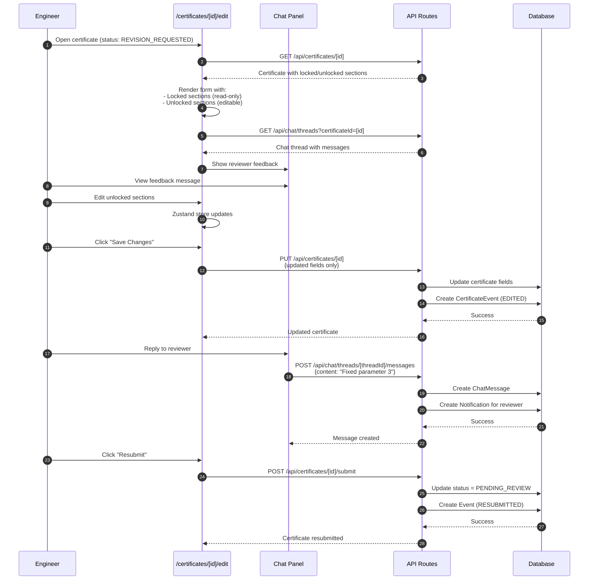
```mermaid
sequenceDiagram
    autonumber
    participant E as Engineer
    participant FE as /certificates/[id]/edit
    participant Chat as Chat Panel
    participant API as API Routes
    participant DB as Database

    E->>FE: Open certificate (status: REVISION_REQUESTED)
    FE->>API: GET /api/certificates/[id]
    API-->>FE: Certificate with locked/unlocked sections

    FE->>FE: Render form with:<br/>- Locked sections (read-only)<br/>- Unlocked sections (editable)

    FE->>API: GET /api/chat/threads?certificateId=[id]
    API-->>FE: Chat thread with messages
    FE->>Chat: Show reviewer feedback

    E->>Chat: View feedback message
    E->>FE: Edit unlocked sections
    FE->>FE: Zustand store updates

    E->>FE: Click "Save Changes"
    FE->>API: PUT /api/certificates/[id]<br/>{updated fields only}

    API->>DB: Update certificate fields
    API->>DB: Create CertificateEvent (EDITED)
    DB-->>API: Success
    API-->>FE: Updated certificate

    E->>Chat: Reply to reviewer
    Chat->>API: POST /api/chat/threads/[threadId]/messages<br/>{content: "Fixed parameter 3"}
    API->>DB: Create ChatMessage
    API->>DB: Create Notification for reviewer
    DB-->>API: Success
    API-->>Chat: Message created

    E->>FE: Click "Resubmit"
    FE->>API: POST /api/certificates/[id]/submit
    API->>DB: Update status = PENDING_REVIEW
    API->>DB: Create Event (RESUBMITTED)
    DB-->>API: Success
    API-->>FE: Certificate resubmitted
```

---

# 4. Unlock Request Flow

## 4.1 Engineer Requests Section Unlock

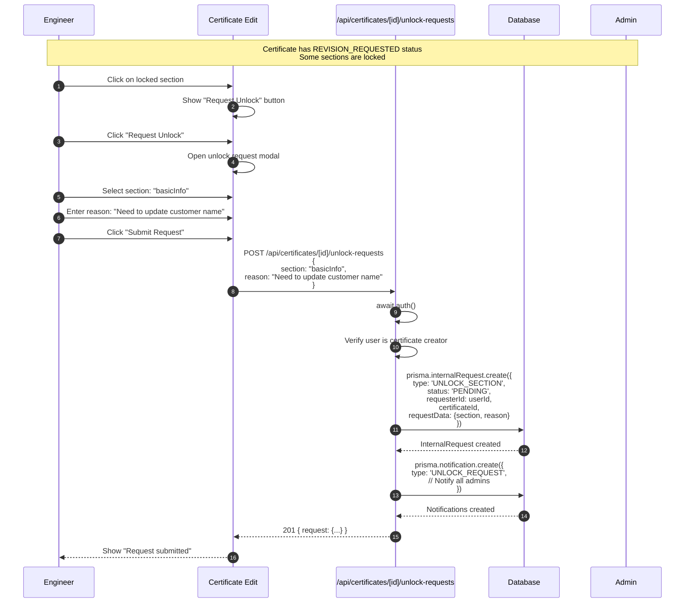
```mermaid
sequenceDiagram
    autonumber
    participant E as Engineer
    participant FE as Certificate Edit
    participant API as /api/certificates/[id]/unlock-requests
    participant DB as Database
    participant A as Admin

    Note over E,A: Certificate has REVISION_REQUESTED status<br/>Some sections are locked

    E->>FE: Click on locked section
    FE->>FE: Show "Request Unlock" button

    E->>FE: Click "Request Unlock"
    FE->>FE: Open unlock request modal

    E->>FE: Select section: "basicInfo"
    E->>FE: Enter reason: "Need to update customer name"
    E->>FE: Click "Submit Request"

    FE->>API: POST /api/certificates/[id]/unlock-requests<br/>{<br/>  section: "basicInfo",<br/>  reason: "Need to update customer name"<br/>}

    API->>API: await auth()
    API->>API: Verify user is certificate creator

    API->>DB: prisma.internalRequest.create({<br/>  type: 'UNLOCK_SECTION',<br/>  status: 'PENDING',<br/>  requesterId: userId,<br/>  certificateId,<br/>  requestData: {section, reason}<br/>})

    DB-->>API: InternalRequest created

    API->>DB: prisma.notification.create({<br/>  type: 'UNLOCK_REQUEST',<br/>  // Notify all admins<br/>})

    DB-->>API: Notifications created
    API-->>FE: 201 { request: {...} }
    FE-->>E: Show "Request submitted"
```

**Endpoint**: `POST /api/certificates/[id]/unlock-requests`

**Request Body**:
```json
{
  "section": "basicInfo",
  "reason": "Need to update customer name - typo in company name"
}
```

**Response**:
```json
{
  "id": "clx...",
  "type": "UNLOCK_SECTION",
  "status": "PENDING",
  "requestData": {
    "section": "basicInfo",
    "reason": "Need to update customer name - typo in company name"
  },
  "createdAt": "2024-01-15T12:00:00Z"
}
```

---

## 4.2 Admin Reviews Unlock Request

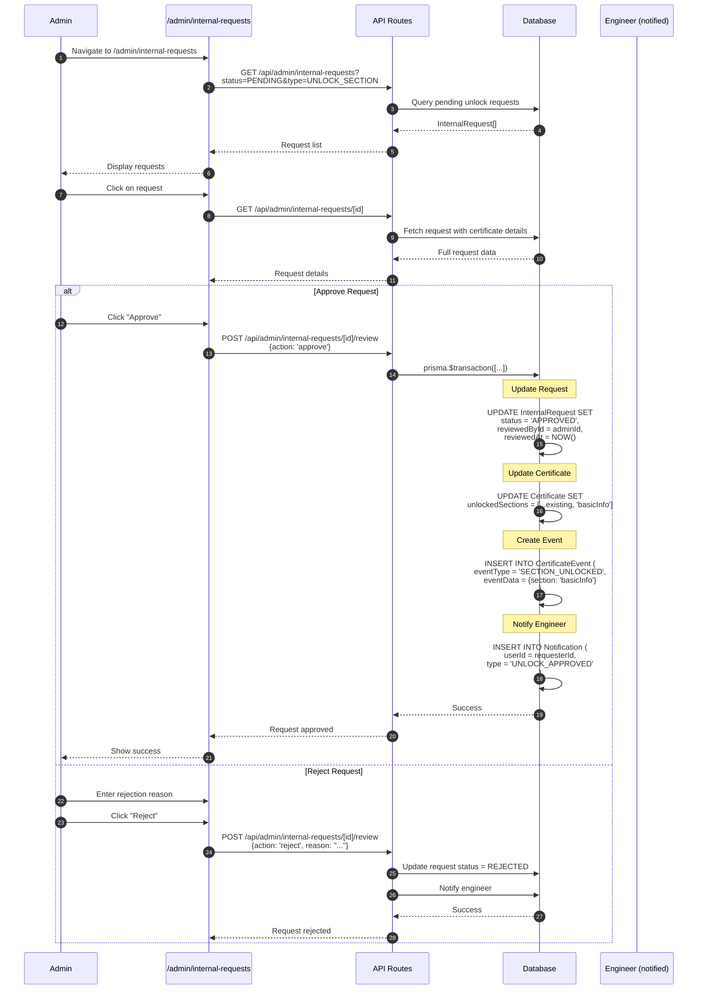
```mermaid
sequenceDiagram
    autonumber
    participant A as Admin
    participant FE as /admin/internal-requests
    participant API as API Routes
    participant DB as Database
    participant E as Engineer (notified)

    A->>FE: Navigate to /admin/internal-requests
    FE->>API: GET /api/admin/internal-requests?<br/>status=PENDING&type=UNLOCK_SECTION
    API->>DB: Query pending unlock requests
    DB-->>API: InternalRequest[]
    API-->>FE: Request list
    FE-->>A: Display requests

    A->>FE: Click on request
    FE->>API: GET /api/admin/internal-requests/[id]
    API->>DB: Fetch request with certificate details
    DB-->>API: Full request data
    API-->>FE: Request details

    alt Approve Request
        A->>FE: Click "Approve"
        FE->>API: POST /api/admin/internal-requests/[id]/review<br/>{action: 'approve'}

        API->>DB: prisma.$transaction([...])

        Note over DB: Update Request
        DB->>DB: UPDATE InternalRequest SET<br/>  status = 'APPROVED',<br/>  reviewedById = adminId,<br/>  reviewedAt = NOW()

        Note over DB: Update Certificate
        DB->>DB: UPDATE Certificate SET<br/>  unlockedSections = [...existing, 'basicInfo']

        Note over DB: Create Event
        DB->>DB: INSERT INTO CertificateEvent (<br/>  eventType = 'SECTION_UNLOCKED',<br/>  eventData = {section: 'basicInfo'}<br/>)

        Note over DB: Notify Engineer
        DB->>DB: INSERT INTO Notification (<br/>  userId = requesterId,<br/>  type = 'UNLOCK_APPROVED'<br/>)

        DB-->>API: Success
        API-->>FE: Request approved
        FE-->>A: Show success
    else Reject Request
        A->>FE: Enter rejection reason
        A->>FE: Click "Reject"
        FE->>API: POST /api/admin/internal-requests/[id]/review<br/>{action: 'reject', reason: "..."}

        API->>DB: Update request status = REJECTED
        API->>DB: Notify engineer
        DB-->>API: Success
        API-->>FE: Request rejected
    end
```

---

# 5. Customer Review Flow

## 5.1 Send Certificate to Customer

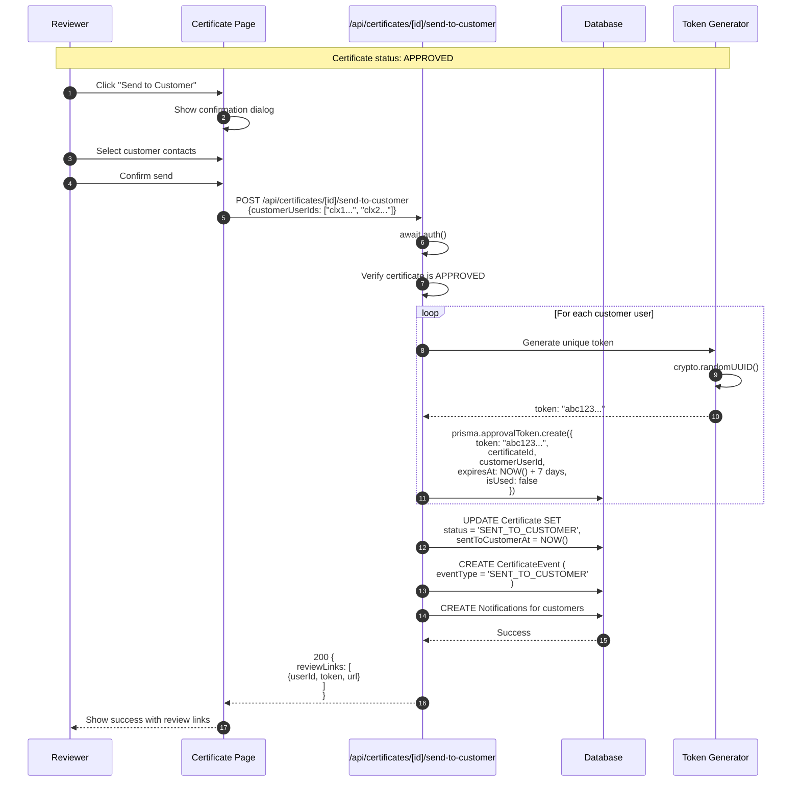
```mermaid
sequenceDiagram
    autonumber
    participant R as Reviewer
    participant FE as Certificate Page
    participant API as /api/certificates/[id]/send-to-customer
    participant DB as Database
    participant Token as Token Generator

    Note over R,Token: Certificate status: APPROVED

    R->>FE: Click "Send to Customer"
    FE->>FE: Show confirmation dialog

    R->>FE: Select customer contacts
    R->>FE: Confirm send

    FE->>API: POST /api/certificates/[id]/send-to-customer<br/>{customerUserIds: ["clx1...", "clx2..."]}

    API->>API: await auth()
    API->>API: Verify certificate is APPROVED

    loop For each customer user
        API->>Token: Generate unique token
        Token->>Token: crypto.randomUUID()
        Token-->>API: token: "abc123..."

        API->>DB: prisma.approvalToken.create({<br/>  token: "abc123...",<br/>  certificateId,<br/>  customerUserId,<br/>  expiresAt: NOW() + 7 days,<br/>  isUsed: false<br/>})
    end

    API->>DB: UPDATE Certificate SET<br/>  status = 'SENT_TO_CUSTOMER',<br/>  sentToCustomerAt = NOW()

    API->>DB: CREATE CertificateEvent (<br/>  eventType = 'SENT_TO_CUSTOMER'<br/>)

    API->>DB: CREATE Notifications for customers

    DB-->>API: Success
    API-->>FE: 200 {<br/>  reviewLinks: [<br/>    {userId, token, url}<br/>  ]<br/>}

    FE-->>R: Show success with review links
```

**Endpoint**: `POST /api/certificates/[id]/send-to-customer`

**Request Body**:
```json
{
  "customerUserIds": ["clx123...", "clx456..."]
}
```

**Response**:
```json
{
  "success": true,
  "reviewLinks": [
    {
      "customerUserId": "clx123...",
      "customerName": "John Customer",
      "token": "abc123-def456-...",
      "url": "https://app.htacalibration.com/customer/review/abc123-def456-...",
      "expiresAt": "2024-01-22T12:00:00Z"
    }
  ]
}
```

---

## 5.2 Customer Opens Review Link

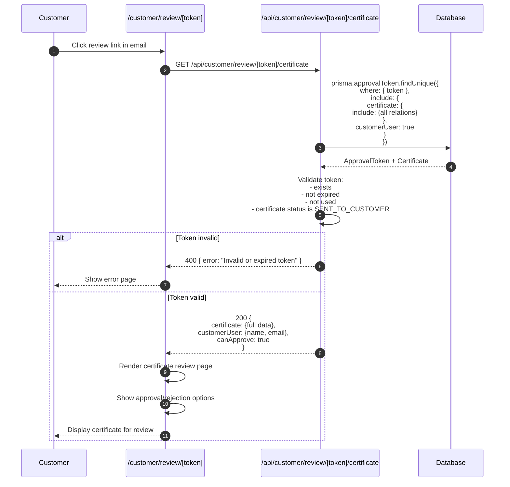
```mermaid
sequenceDiagram
    autonumber
    participant C as Customer
    participant FE as /customer/review/[token]
    participant API as /api/customer/review/[token]/certificate
    participant DB as Database

    C->>FE: Click review link in email

    FE->>API: GET /api/customer/review/[token]/certificate

    API->>DB: prisma.approvalToken.findUnique({<br/>  where: { token },<br/>  include: {<br/>    certificate: {<br/>      include: {all relations}<br/>    },<br/>    customerUser: true<br/>  }<br/>})

    DB-->>API: ApprovalToken + Certificate

    API->>API: Validate token:<br/>- exists<br/>- not expired<br/>- not used<br/>- certificate status is SENT_TO_CUSTOMER

    alt Token invalid
        API-->>FE: 400 { error: "Invalid or expired token" }
        FE-->>C: Show error page
    else Token valid
        API-->>FE: 200 {<br/>  certificate: {full data},<br/>  customerUser: {name, email},<br/>  canApprove: true<br/>}

        FE->>FE: Render certificate review page
        FE->>FE: Show approval/rejection options
        FE-->>C: Display certificate for review
    end
```

---

## 5.3 Customer Approves Certificate

```mermaid
sequenceDiagram
    autonumber
    participant C as Customer
    participant FE as Review Page
    participant Sig as Signature Pad
    participant Store as Signing Evidence Store
    participant API as /api/customer/review/[token]/approve
    participant DB as Database

    C->>FE: Review certificate content
    C->>FE: Click "Approve"

    FE->>FE: Show signature collection modal

    Note over C,Store: Collect Authorized Signatory
    C->>Sig: Draw signature
    Sig->>Sig: Capture canvas data
    Sig->>Store: addSignature({<br/>  type: 'AUTHORIZED_SIGNATORY',<br/>  imageData: 'data:image/png;base64,...',<br/>  timestamp: Date.now()<br/>})
    Store->>Store: Calculate hash

    Note over C,Store: Collect Witness (if required)
    C->>Sig: Draw witness signature
    Sig->>Store: addSignature({<br/>  type: 'WITNESS',<br/>  ...})

    C->>FE: Enter signatory name
    C->>FE: Enter signatory designation
    C->>FE: Click "Submit Approval"

    FE->>Store: getSigningEvidence()
    Store-->>FE: {<br/>  signatures: [...],<br/>  hashChain: "sha256:...",<br/>  timestamp<br/>}

    FE->>API: POST /api/customer/review/[token]/approve<br/>{<br/>  signatoryName: "John Doe",<br/>  signatoryDesignation: "Quality Manager",<br/>  signatures: [...],<br/>  evidenceHash: "sha256:..."<br/>}

    API->>API: Validate token again
    API->>API: Verify signature data integrity

    API->>DB: prisma.$transaction([...])

    Note over DB: Store Signatures
    DB->>DB: INSERT INTO CustomerSignature (<br/>  certificateId, type, imageData,<br/>  signatoryName, signatoryDesignation<br/>) x N

    Note over DB: Update Certificate
    DB->>DB: UPDATE Certificate SET<br/>  status = 'CUSTOMER_APPROVED',<br/>  customerApprovedAt = NOW(),<br/>  customerApprovedById = customerUserId

    Note over DB: Mark Token Used
    DB->>DB: UPDATE ApprovalToken SET<br/>  isUsed = true,<br/>  usedAt = NOW()

    Note over DB: Create Event
    DB->>DB: INSERT INTO CertificateEvent (<br/>  eventType = 'CUSTOMER_APPROVED',<br/>  userRole = 'CUSTOMER'<br/>)

    Note over DB: Notify Staff
    DB->>DB: INSERT INTO Notification (<br/>  // Notify reviewer and admins<br/>)

    DB-->>API: Transaction complete
    API-->>FE: 200 { success: true }
    FE->>Store: clearEvidence()
    FE-->>C: Show success message
```

**Endpoint**: `POST /api/customer/review/[token]/approve`

**Request Body**:
```json
{
  "signatoryName": "John Doe",
  "signatoryDesignation": "Quality Manager",
  "signatures": [
    {
      "type": "AUTHORIZED_SIGNATORY",
      "imageData": "data:image/png;base64,iVBORw0KGgo...",
      "timestamp": 1705320000000
    },
    {
      "type": "WITNESS",
      "imageData": "data:image/png;base64,iVBORw0KGgo...",
      "timestamp": 1705320005000
    }
  ],
  "evidenceHash": "sha256:abc123..."
}
```

---

## 5.4 Customer Rejects Certificate

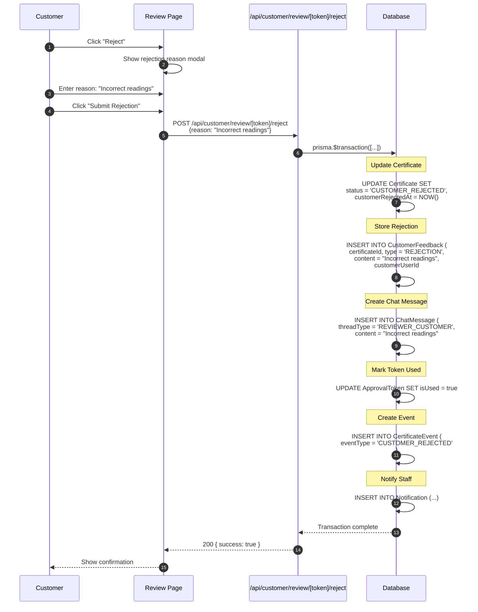
```mermaid
sequenceDiagram
    autonumber
    participant C as Customer
    participant FE as Review Page
    participant API as /api/customer/review/[token]/reject
    participant DB as Database

    C->>FE: Click "Reject"
    FE->>FE: Show rejection reason modal

    C->>FE: Enter reason: "Incorrect readings"
    C->>FE: Click "Submit Rejection"

    FE->>API: POST /api/customer/review/[token]/reject<br/>{reason: "Incorrect readings"}

    API->>DB: prisma.$transaction([...])

    Note over DB: Update Certificate
    DB->>DB: UPDATE Certificate SET<br/>  status = 'CUSTOMER_REJECTED',<br/>  customerRejectedAt = NOW()

    Note over DB: Store Rejection
    DB->>DB: INSERT INTO CustomerFeedback (<br/>  certificateId, type = 'REJECTION',<br/>  content = "Incorrect readings",<br/>  customerUserId<br/>)

    Note over DB: Create Chat Message
    DB->>DB: INSERT INTO ChatMessage (<br/>  threadType = 'REVIEWER_CUSTOMER',<br/>  content = "Incorrect readings"<br/>)

    Note over DB: Mark Token Used
    DB->>DB: UPDATE ApprovalToken SET isUsed = true

    Note over DB: Create Event
    DB->>DB: INSERT INTO CertificateEvent (<br/>  eventType = 'CUSTOMER_REJECTED'<br/>)

    Note over DB: Notify Staff
    DB->>DB: INSERT INTO Notification (...)

    DB-->>API: Transaction complete
    API-->>FE: 200 { success: true }
    FE-->>C: Show confirmation
```

---

# 6. Admin Authorization Flow

## 6.1 View Authorization Queue

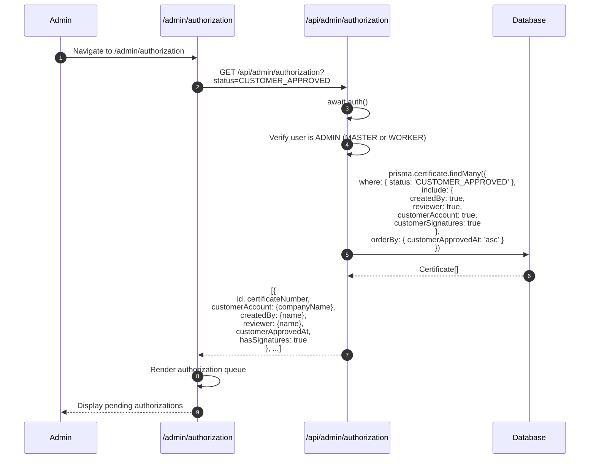
```mermaid
sequenceDiagram
    autonumber
    participant A as Admin
    participant FE as /admin/authorization
    participant API as /api/admin/authorization
    participant DB as Database

    A->>FE: Navigate to /admin/authorization

    FE->>API: GET /api/admin/authorization?<br/>status=CUSTOMER_APPROVED

    API->>API: await auth()
    API->>API: Verify user is ADMIN (MASTER or WORKER)

    API->>DB: prisma.certificate.findMany({<br/>  where: { status: 'CUSTOMER_APPROVED' },<br/>  include: {<br/>    createdBy: true,<br/>    reviewer: true,<br/>    customerAccount: true,<br/>    customerSignatures: true<br/>  },<br/>  orderBy: { customerApprovedAt: 'asc' }<br/>})

    DB-->>API: Certificate[]

    API-->>FE: [{<br/>  id, certificateNumber,<br/>  customerAccount: {companyName},<br/>  createdBy: {name},<br/>  reviewer: {name},<br/>  customerApprovedAt,<br/>  hasSignatures: true<br/>}, ...]

    FE->>FE: Render authorization queue
    FE-->>A: Display pending authorizations
```

---

## 6.2 Authorize Certificate

```mermaid
sequenceDiagram
    autonumber
    participant A as Admin
    participant FE as Authorization Page
    participant API as /api/admin/authorization/[id]/authorize
    participant DB as Database
    participant Queue as Signing Queue

    A->>FE: Open certificate details
    FE->>API: GET /api/admin/authorization/[id]
    API-->>FE: Full certificate data with signatures

    A->>FE: Review certificate and signatures
    A->>FE: Click "Authorize"

    FE->>FE: Confirm dialog

    FE->>API: POST /api/admin/authorization/[id]/authorize<br/>{adminSignature: {...}}

    API->>API: await auth()
    API->>API: Verify user is ADMIN

    API->>DB: prisma.$transaction([...])

    Note over DB: Update Certificate
    DB->>DB: UPDATE Certificate SET<br/>  status = 'ADMIN_AUTHORIZED',<br/>  authorizedAt = NOW(),<br/>  authorizedById = adminId

    Note over DB: Create Final Revision
    DB->>DB: INSERT INTO CertificateRevision (<br/>  revision = currentRevision + 1,<br/>  status = 'ADMIN_AUTHORIZED',<br/>  snapshotData = {complete certificate},<br/>  isFinal = true<br/>)

    Note over DB: Store Admin Signature
    DB->>DB: INSERT INTO AdminSignature (<br/>  certificateId, adminId,<br/>  signatureData<br/>)

    Note over DB: Create Event
    DB->>DB: INSERT INTO CertificateEvent (<br/>  eventType = 'ADMIN_AUTHORIZED',<br/>  userRole = 'ADMIN'<br/>)

    Note over DB: Queue PDF Generation
    DB->>DB: INSERT INTO SigningJob (<br/>  certificateId,<br/>  status = 'PENDING',<br/>  jobType = 'GENERATE_SIGNED_PDF'<br/>)

    Note over DB: Notify All Stakeholders
    DB->>DB: INSERT INTO Notification (...) x N

    DB-->>API: Transaction complete
    API-->>FE: 200 {<br/>  certificate: {status: 'ADMIN_AUTHORIZED'},<br/>  signingJobId: "clx..."<br/>}

    FE-->>A: Show success

    Note over Queue: Background Process
    Queue->>DB: Poll for PENDING jobs
    Queue->>Queue: Generate PDF
    Queue->>Queue: Apply digital signatures
    Queue->>DB: Store PDF, update job status
```

**Endpoint**: `POST /api/admin/authorization/[id]/authorize`

**Request Body**:
```json
{
  "adminSignature": {
    "imageData": "data:image/png;base64,...",
    "timestamp": 1705320000000
  },
  "comments": "Authorized for release"
}
```

**Certificate State After Authorization**:
```
Certificate:
  status: ADMIN_AUTHORIZED
  authorizedAt: 2024-01-15T14:00:00Z
  authorizedById: admin-id
  currentRevision: 3

CertificateRevision:
  revision: 3
  status: ADMIN_AUTHORIZED
  isFinal: true
  snapshotData: {complete certificate JSON}

SigningJob:
  status: PENDING → PROCESSING → COMPLETED
  pdfUrl: /api/certificates/xxx/download-signed
```

---

# 7. Chat & Messaging Flow

## 7.1 Chat Between Engineer and Reviewer

```mermaid
sequenceDiagram
    autonumber
    participant E as Engineer
    participant FE as Certificate Page
    participant Chat as Chat Panel
    participant API as /api/chat
    participant DB as Database
    participant R as Reviewer

    E->>FE: Open certificate with feedback
    FE->>API: GET /api/chat/threads?certificateId=[id]

    API->>DB: prisma.chatThread.findMany({<br/>  where: { certificateId },<br/>  include: {<br/>    messages: { orderBy: {createdAt: 'desc'}, take: 50 },<br/>    participants: true<br/>  }<br/>})

    DB-->>API: ChatThread[]
    API-->>FE: Threads with messages
    FE->>Chat: Render chat panel

    E->>Chat: Type message "Fixed the issue"
    E->>Chat: Click Send

    Chat->>API: POST /api/chat/threads/[threadId]/messages<br/>{content: "Fixed the issue"}

    API->>API: await auth()
    API->>API: Verify user can access thread

    API->>DB: prisma.chatMessage.create({<br/>  threadId,<br/>  senderId: userId,<br/>  content: "Fixed the issue",<br/>  messageType: 'TEXT'<br/>})

    API->>DB: prisma.notification.create({<br/>  userId: reviewerId,<br/>  type: 'NEW_CHAT_MESSAGE'<br/>})

    DB-->>API: Message created
    API-->>Chat: 201 { message: {...} }
    Chat->>Chat: Add to message list
    Chat-->>E: Show sent message

    Note over R: Reviewer receives notification
    R->>FE: Open certificate
    FE->>API: GET /api/chat/threads/[threadId]/messages
    API-->>FE: Messages including new one
    FE-->>R: Display conversation
```

---

## 7.2 Upload Chat Attachment

```mermaid
sequenceDiagram
    autonumber
    participant U as User
    participant Chat as Chat Panel
    participant API as /api/chat/threads/[id]/attachments
    participant Store as File Storage
    participant DB as Database

    U->>Chat: Click attachment icon
    U->>Chat: Select file

    Chat->>Chat: Validate file (type, size)

    Chat->>API: POST /api/chat/threads/[threadId]/attachments<br/>Content-Type: multipart/form-data<br/>file: <binary>

    API->>Store: Upload file
    Store-->>API: fileUrl, fileKey

    API->>DB: prisma.chatAttachment.create({<br/>  threadId,<br/>  fileName,<br/>  fileUrl,<br/>  fileSize,<br/>  mimeType,<br/>  uploadedById<br/>})

    API->>DB: prisma.chatMessage.create({<br/>  threadId,<br/>  senderId,<br/>  messageType: 'ATTACHMENT',<br/>  attachmentId<br/>})

    DB-->>API: Attachment + Message created
    API-->>Chat: 201 { attachment, message }
    Chat->>Chat: Display attachment in chat
```

---

# 8. Notification Flow

## 8.1 Notification Creation (Internal)

```mermaid
sequenceDiagram
    autonumber
    participant Action as Any Action
    participant Service as Notification Service
    participant DB as Database

    Note over Action: Various triggers:<br/>- Certificate submitted<br/>- Review complete<br/>- Unlock approved<br/>- New chat message

    Action->>Service: createNotification({<br/>  userId,<br/>  type,<br/>  title,<br/>  message,<br/>  certificateId<br/>})

    Service->>DB: prisma.notification.create({<br/>  userId,<br/>  type: 'CERTIFICATE_SUBMITTED',<br/>  title: 'New certificate for review',<br/>  message: 'HTA-2024-001 submitted by...',<br/>  certificateId,<br/>  isRead: false,<br/>  createdAt: NOW()<br/>})

    DB-->>Service: Notification created
```

---

## 8.2 Fetch Notifications

```mermaid
sequenceDiagram
    autonumber
    participant U as User
    participant FE as NotificationDropdown
    participant API as /api/notifications
    participant DB as Database

    Note over U,DB: On page load / interval

    FE->>API: GET /api/notifications?<br/>limit=20&includeRead=false

    API->>API: await auth()

    API->>DB: prisma.notification.findMany({<br/>  where: {<br/>    userId: session.user.id,<br/>    isRead: false<br/>  },<br/>  orderBy: { createdAt: 'desc' },<br/>  take: 20,<br/>  include: { certificate: true }<br/>})

    DB-->>API: Notification[]
    API-->>FE: [{<br/>  id, type, title, message,<br/>  isRead, createdAt,<br/>  certificate: {id, certificateNumber}<br/>}, ...]

    FE->>FE: Render notification list
    FE->>FE: Show badge with unread count
```

---

## 8.3 Mark Notifications as Read

```mermaid
sequenceDiagram
    autonumber
    participant U as User
    participant FE as NotificationDropdown
    participant API as /api/notifications/mark-read
    participant DB as Database

    U->>FE: Click notification

    FE->>API: POST /api/notifications/mark-read<br/>{notificationIds: ["clx1...", "clx2..."]}

    API->>DB: prisma.notification.updateMany({<br/>  where: {<br/>    id: { in: notificationIds },<br/>    userId: session.user.id<br/>  },<br/>  data: { isRead: true, readAt: NOW() }<br/>})

    DB-->>API: { count: 2 }
    API-->>FE: 200 { marked: 2 }
    FE->>FE: Update UI, decrease badge count

    FE->>FE: Navigate to notification target
```

---

# 9. User Management Flow

## 9.1 Create New User (Admin)

```mermaid
sequenceDiagram
    autonumber
    participant A as Admin
    participant FE as /admin/users/new
    participant API as /api/admin/users
    participant DB as Database
    participant Hash as bcrypt

    A->>FE: Navigate to /admin/users/new
    A->>FE: Fill user form:<br/>- name: "New Engineer"<br/>- email: "new@htaipl.com"<br/>- role: "ENGINEER"<br/>- password: "tempPass123"

    A->>FE: Click "Create User"

    FE->>API: POST /api/admin/users<br/>{<br/>  name: "New Engineer",<br/>  email: "new@htaipl.com",<br/>  role: "ENGINEER",<br/>  password: "tempPass123"<br/>}

    API->>API: await auth()
    API->>API: Verify user is MASTER ADMIN

    API->>DB: Check email uniqueness
    DB-->>API: No existing user

    API->>Hash: bcrypt.hash(password, 12)
    Hash-->>API: passwordHash

    API->>DB: prisma.user.create({<br/>  name,<br/>  email,<br/>  role: 'ENGINEER',<br/>  passwordHash,<br/>  isActive: true,<br/>  createdById: adminId<br/>})

    DB-->>API: User created
    API-->>FE: 201 { user: {...} }
    FE->>FE: Show success
    FE->>FE: Navigate to user list
```

**Endpoint**: `POST /api/admin/users`

**Request Body**:
```json
{
  "name": "New Engineer",
  "email": "new@htaipl.com",
  "role": "ENGINEER",
  "password": "tempPass123",
  "assignedAdminId": "clx..."
}
```

---

## 9.2 Deactivate User

```mermaid
sequenceDiagram
    autonumber
    participant A as Admin
    participant FE as User Management
    participant API as /api/admin/users/[id]
    participant DB as Database

    A->>FE: Click "Deactivate" on user row
    FE->>FE: Confirm dialog

    FE->>API: DELETE /api/admin/users/[id]

    API->>API: Verify not self-deletion
    API->>API: Verify user has no active certificates

    API->>DB: prisma.user.update({<br/>  where: { id },<br/>  data: {<br/>    isActive: false,<br/>    deactivatedAt: NOW(),<br/>    deactivatedById: adminId<br/>  }<br/>})

    DB-->>API: User deactivated
    API-->>FE: 200 { success: true }
    FE->>FE: Remove from active list
```

---

# 10. Customer Registration Flow

## 10.1 Customer Self-Registration

```mermaid
sequenceDiagram
    autonumber
    participant C as Customer
    participant FE as /customer/register
    participant API as API Routes
    participant DB as Database
    participant A as Admin (notified)

    C->>FE: Navigate to /customer/register

    FE->>API: GET /api/customer/register/companies
    API->>DB: Get list of customer accounts
    DB-->>API: CustomerAccount[]
    API-->>FE: Companies for dropdown

    C->>FE: Fill registration form:<br/>- Select company: "Acme Industries"<br/>- name: "Jane Customer"<br/>- email: "jane@acme.com"<br/>- password: "securePass"

    C->>FE: Click "Register"

    FE->>API: POST /api/customer/register<br/>{<br/>  customerAccountId,<br/>  name, email, password<br/>}

    API->>DB: Check email not already used
    API->>DB: prisma.customerRegistration.create({<br/>  customerAccountId,<br/>  name,<br/>  email,<br/>  passwordHash: bcrypt.hash(password),<br/>  status: 'PENDING'<br/>})

    API->>DB: Notify admins of new registration

    DB-->>API: Registration created
    API-->>FE: 201 { success: true }
    FE-->>C: Show "Registration pending approval"

    Note over A: Admin receives notification
```

---

## 10.2 Admin Approves Registration

```mermaid
sequenceDiagram
    autonumber
    participant A as Admin
    participant FE as /admin/registrations
    participant API as API Routes
    participant DB as Database
    participant C as Customer (notified)

    A->>FE: Navigate to /admin/registrations
    FE->>API: GET /api/admin/registrations
    API-->>FE: Pending registrations

    A->>FE: Click "Approve" on registration

    FE->>API: POST /api/admin/registrations/[id]/approve

    API->>DB: prisma.$transaction([...])

    Note over DB: Create Customer User
    DB->>DB: INSERT INTO CustomerUser (<br/>  email, name, passwordHash,<br/>  customerAccountId,<br/>  isActive: true<br/>)

    Note over DB: Update Registration
    DB->>DB: UPDATE CustomerRegistration SET<br/>  status = 'APPROVED',<br/>  approvedById = adminId,<br/>  approvedAt = NOW()

    Note over DB: Delete Registration (optional)
    DB->>DB: DELETE FROM CustomerRegistration<br/>  WHERE id = registrationId

    DB-->>API: User created
    API-->>FE: 200 { user: {...} }
    FE-->>A: Show success

    Note over C: Customer can now login
```

---

# 11. Instrument Management Flow

## 11.1 Add Master Instrument

```mermaid
sequenceDiagram
    autonumber
    participant A as Admin
    participant FE as /admin/instruments
    participant API as /api/admin/instruments
    participant DB as Database

    A->>FE: Click "Add Instrument"
    A->>FE: Fill form:<br/>- name: "Fluke 5700A"<br/>- make: "Fluke"<br/>- model: "5700A"<br/>- serialNumber: "12345"<br/>- certificateNumber: "CAL-001"<br/>- validUntil: "2025-06-01"

    FE->>API: POST /api/admin/instruments<br/>{name, make, model, ...}

    API->>API: await auth()
    API->>API: Verify admin

    API->>DB: prisma.instrumentMaster.create({<br/>  name, make, model,<br/>  serialNumber, certificateNumber,<br/>  validUntil,<br/>  isActive: true,<br/>  createdById: adminId<br/>})

    DB-->>API: Instrument created
    API-->>FE: 201 { instrument: {...} }
    FE->>FE: Add to list
```

---

## 11.2 Import Instruments from CSV

```mermaid
sequenceDiagram
    autonumber
    participant A as Admin
    participant FE as Import Dialog
    participant API as /api/admin/instruments/import
    participant Parser as CSV Parser
    participant DB as Database

    A->>FE: Click "Import"
    A->>FE: Select CSV file

    FE->>API: POST /api/admin/instruments/import<br/>Content-Type: multipart/form-data<br/>file: instruments.csv

    API->>Parser: Parse CSV
    Parser-->>API: [{name, make, model, ...}, ...]

    API->>API: Validate each row

    loop For each valid row
        API->>DB: prisma.instrumentMaster.upsert({<br/>  where: { serialNumber },<br/>  create: {...},<br/>  update: {...}<br/>})
    end

    DB-->>API: Import complete
    API-->>FE: 200 {<br/>  imported: 45,<br/>  skipped: 3,<br/>  errors: [{row: 5, error: "..."}]<br/>}

    FE-->>A: Show import summary
```

---

# 12. PDF Generation & Signing Flow

## 12.1 Queue PDF Generation

```mermaid
sequenceDiagram
    autonumber
    participant Auth as Authorization Action
    participant DB as Database
    participant Queue as SigningJob Table

    Auth->>DB: Certificate authorized

    Auth->>Queue: INSERT INTO SigningJob (<br/>  certificateId,<br/>  status = 'PENDING',<br/>  jobType = 'GENERATE_SIGNED_PDF',<br/>  priority = 'NORMAL',<br/>  createdAt = NOW()<br/>)

    Queue-->>Auth: Job queued
```

---

## 12.2 Process PDF Generation (Background)

```mermaid
sequenceDiagram
    autonumber
    participant Cron as Queue Processor
    participant API as /api/queue/process
    participant DB as Database
    participant PDF as PDF Generator
    participant Sign as Digital Signer
    participant Store as Cloud Storage

    Note over Cron: Triggered by cron or manual

    Cron->>API: POST /api/queue/process

    API->>DB: SELECT * FROM SigningJob<br/>  WHERE status = 'PENDING'<br/>  ORDER BY priority, createdAt<br/>  LIMIT 5

    DB-->>API: SigningJob[]

    loop For each job
        API->>DB: UPDATE SigningJob SET status = 'PROCESSING'

        API->>DB: Fetch certificate with all relations
        DB-->>API: Full certificate data

        API->>PDF: Generate PDF from template
        PDF->>PDF: Render certificate data
        PDF->>PDF: Add parameters table
        PDF->>PDF: Add master instruments
        PDF->>PDF: Add customer signatures
        PDF->>PDF: Add admin signature
        PDF-->>API: PDF buffer

        API->>Sign: Apply digital signature
        Sign->>Sign: Add timestamp
        Sign->>Sign: Sign with certificate
        Sign-->>API: Signed PDF buffer

        API->>Store: Upload to GCS
        Store-->>API: pdfUrl

        API->>DB: UPDATE SigningJob SET<br/>  status = 'COMPLETED',<br/>  completedAt = NOW()

        API->>DB: UPDATE Certificate SET<br/>  signedPdfUrl = pdfUrl

        API->>DB: Create notification for stakeholders
    end

    API-->>Cron: { processed: 5, failed: 0 }
```

---

## 12.3 Download Signed PDF

```mermaid
sequenceDiagram
    autonumber
    participant U as User
    participant FE as Certificate Page
    participant API as /api/certificates/[id]/download-signed
    participant DB as Database
    participant Store as Cloud Storage

    U->>FE: Click "Download Signed PDF"

    FE->>API: GET /api/certificates/[id]/download-signed

    API->>API: await auth()
    API->>API: Verify user can access certificate

    API->>DB: prisma.certificate.findUnique({<br/>  where: { id },<br/>  select: { signedPdfUrl, status }<br/>})

    alt PDF not ready
        DB-->>API: { signedPdfUrl: null }
        API-->>FE: 404 { error: "PDF not yet generated" }
        FE-->>U: Show "PDF being generated..."
    else PDF ready
        DB-->>API: { signedPdfUrl: "gs://bucket/..." }

        API->>Store: Generate signed URL (15 min expiry)
        Store-->>API: Signed download URL

        API-->>FE: 302 Redirect to signed URL
        FE->>Store: Download PDF
        Store-->>FE: PDF binary
        FE-->>U: Browser downloads file
    end
```

---

# 13. API Reference - Complete

## Authentication

| Method | Endpoint | Purpose | Auth |
|--------|----------|---------|------|
| ALL | `/api/auth/[...nextauth]` | NextAuth handlers | Public |
| POST | `/api/customer/activate` | Activate customer account | Public |
| POST | `/api/customer/register` | Customer registration | Public |
| GET | `/api/customer/register/companies` | Get companies for registration | Public |

## Certificates

| Method | Endpoint | Purpose | Auth |
|--------|----------|---------|------|
| GET | `/api/certificates` | List certificates | Staff |
| POST | `/api/certificates` | Create certificate | Staff |
| GET | `/api/certificates/check-number` | Check number uniqueness | Staff |
| GET | `/api/certificates/[id]` | Get certificate | Staff |
| PUT | `/api/certificates/[id]` | Update certificate | Staff |
| DELETE | `/api/certificates/[id]` | Delete certificate | Staff |
| POST | `/api/certificates/[id]/submit` | Submit for review | Engineer |
| POST | `/api/certificates/[id]/review` | Review (approve/reject) | Reviewer |
| POST | `/api/certificates/[id]/send-to-customer` | Send to customer | Reviewer |
| POST | `/api/certificates/[id]/reply-to-customer` | Reply to customer | Reviewer |
| POST | `/api/certificates/[id]/change-reviewer` | Change reviewer | Admin |
| POST | `/api/certificates/[id]/assign-revision` | Assign revision | Admin |
| POST | `/api/certificates/[id]/unlock-requests` | Request unlock | Engineer |
| GET | `/api/certificates/[id]/pdf-data` | Get PDF data | Staff |
| GET | `/api/certificates/[id]/download-signed` | Download signed PDF | All |
| POST | `/api/certificates/[id]/verify-evidence` | Verify signatures | Staff |
| GET | `/api/certificates/[id]/uuc-images` | List UUC images | Staff |
| POST | `/api/certificates/[id]/uuc-images` | Upload UUC image | Staff |
| GET | `/api/certificates/[id]/uuc-images/[imageId]` | Get image info | Staff |
| DELETE | `/api/certificates/[id]/uuc-images/[imageId]` | Delete image | Staff |
| GET | `/api/certificates/[id]/uuc-images/[imageId]/file` | Get image file | Staff |

## Admin

| Method | Endpoint | Purpose | Auth |
|--------|----------|---------|------|
| GET | `/api/admin/certificates` | List all certificates | Admin |
| GET | `/api/admin/certificates/[id]` | Get certificate | Admin |
| PUT | `/api/admin/certificates/[id]/edit` | Edit certificate | Admin |
| GET | `/api/admin/authorization` | Authorization queue | Admin |
| GET | `/api/admin/authorization/[id]` | Authorization details | Admin |
| POST | `/api/admin/authorization/[id]/authorize` | Authorize certificate | Admin |
| POST | `/api/admin/authorization/[id]/message` | Send message | Admin |
| GET | `/api/admin/users` | List users | Admin |
| POST | `/api/admin/users` | Create user | Master |
| GET | `/api/admin/users/admins` | List admins | Admin |
| GET | `/api/admin/users/[id]` | Get user | Admin |
| PUT | `/api/admin/users/[id]` | Update user | Master |
| DELETE | `/api/admin/users/[id]` | Deactivate user | Master |
| POST | `/api/admin/users/[id]/reactivate` | Reactivate user | Master |
| GET | `/api/admin/users/[id]/tat-metrics` | Get TAT metrics | Admin |
| GET | `/api/admin/customers` | List customers | Admin |
| POST | `/api/admin/customers` | Create customer | Master |
| GET | `/api/admin/customers/[id]` | Get customer | Admin |
| PUT | `/api/admin/customers/[id]` | Update customer | Master |
| GET | `/api/admin/customers/[id]/users` | Customer users | Admin |
| POST | `/api/admin/customers/[id]/users` | Add customer user | Admin |
| GET | `/api/admin/customers/requests` | Customer requests | Admin |
| GET | `/api/admin/customers/requests/[id]` | Request details | Admin |
| POST | `/api/admin/customers/requests/[id]/approve` | Approve request | Admin |
| POST | `/api/admin/customers/requests/[id]/reject` | Reject request | Admin |
| GET | `/api/admin/registrations` | Registrations | Admin |
| POST | `/api/admin/registrations/[id]/approve` | Approve registration | Master |
| POST | `/api/admin/registrations/[id]/reject` | Reject registration | Master |
| GET | `/api/admin/instruments` | List instruments | Admin |
| POST | `/api/admin/instruments` | Create instrument | Admin |
| PUT | `/api/admin/instruments/[id]` | Update instrument | Admin |
| DELETE | `/api/admin/instruments/[id]` | Delete instrument | Admin |
| GET | `/api/admin/instruments/export` | Export CSV | Admin |
| POST | `/api/admin/instruments/import` | Import CSV | Admin |
| GET | `/api/admin/internal-requests` | Internal requests | Admin |
| GET | `/api/admin/internal-requests/[id]` | Request details | Admin |
| POST | `/api/admin/internal-requests/[id]/review` | Review request | Admin |

## Customer

| Method | Endpoint | Purpose | Auth |
|--------|----------|---------|------|
| GET | `/api/customer/dashboard` | Dashboard data | Customer |
| GET | `/api/customer/team` | Team members | Customer |
| POST | `/api/customer/team/request` | Request team addition | Customer |
| GET | `/api/customer/review/[token]/certificate` | Get for review | Token |
| POST | `/api/customer/review/[token]/approve` | Approve | Token |
| POST | `/api/customer/review/[token]/reject` | Reject | Token |
| GET/POST | `/api/customer/review/[token]/chat` | Review chat | Token |
| POST | `/api/customer/review/[token]/note` | Add note | Token |

## Chat

| Method | Endpoint | Purpose | Auth |
|--------|----------|---------|------|
| GET | `/api/chat/threads` | List threads | Staff |
| POST | `/api/chat/threads` | Create thread | Staff |
| GET | `/api/chat/threads/[id]` | Get thread | Staff |
| GET | `/api/chat/threads/[id]/messages` | Get messages | Staff |
| POST | `/api/chat/threads/[id]/messages` | Send message | Staff |
| POST | `/api/chat/threads/[id]/attachments` | Upload attachment | Staff |
| POST | `/api/chat/threads/[id]/read` | Mark read | Staff |
| GET | `/api/chat/attachments/[id]` | Get attachment | Staff |
| GET | `/api/chat/unread` | Unread count | Staff |

## Utility

| Method | Endpoint | Purpose | Auth |
|--------|----------|---------|------|
| GET | `/api/health` | Liveness probe | Public |
| GET | `/api/health/ready` | Readiness probe | Public |
| GET | `/api/notifications` | List notifications | Staff |
| POST | `/api/notifications/mark-read` | Mark as read | Staff |
| GET | `/api/notifications/unread-count` | Unread count | Staff |
| GET | `/api/users/reviewers` | Available reviewers | Staff |
| GET | `/api/instruments` | Instrument search | Staff |
| GET | `/api/internal-requests` | User's requests | Staff |
| POST | `/api/queue/process` | Process queue | System |
| POST | `/api/queue/cleanup` | Cleanup queue | System |

## OpenSign Integration

| Method | Endpoint | Purpose | Auth |
|--------|----------|---------|------|
| POST | `/api/opensign/send-for-signature` | Send to OpenSign | Staff |
| POST | `/api/opensign/webhook` | Webhook handler | System |
| POST | `/api/opensign/retry` | Retry failed | Admin |
| GET | `/api/opensign/health` | Health check | Public |

---

# 14. Scripts & Commands

## Development Commands

```bash
# Start development server
npm run dev
# → Starts Next.js on http://localhost:3000 with hot reload

# Build production bundle
npm run build
# → Creates optimized build in .next/

# Start production server
npm run start
# → Runs production build on port 3000

# Lint code
npm run lint
# → Runs ESLint on all files
```

## Database Commands

```bash
# Generate Prisma client
npx prisma generate
# → Creates client in node_modules/.prisma/client

# Push schema to database (dev)
npx prisma db push
# → Syncs schema without migrations

# Seed database
npm run db:seed
# → Runs prisma/seed.ts

# Open Prisma Studio
npx prisma studio
# → Opens GUI at http://localhost:5555

# Create migration
npx prisma migrate dev --name add_field
# → Creates migration file

# Apply migrations (production)
npx prisma migrate deploy
# → Applies pending migrations
```

## Testing Commands

```bash
# Unit tests (watch mode)
npm test
# → Runs vitest in watch mode

# Unit tests (single run)
npm run test:run
# → Runs all tests once

# Coverage report
npm run test:coverage
# → Generates coverage report

# Integration tests (PostgreSQL)
npm run db:start            # Start PostgreSQL via Docker
npm run test:integration
npm run db:stop             # Stop PostgreSQL

# E2E tests
npm run test:e2e
# → Runs Playwright tests

# E2E with browser visible
npm run test:e2e:headed
# → Shows browser during tests

# Visual regression
npm run test:visual:docker
# → Generates baselines in Docker
```

## Docker Commands

```bash
# Build image
docker build -t hta-app .

# Build with no cache
docker build --no-cache -t hta-app .

# Run locally
docker run -p 3000:3000 \
  -e DATABASE_URL="postgresql://..." \
  -e NEXTAUTH_SECRET="..." \
  hta-app

# Tag for registry
docker tag hta-app asia-south1-docker.pkg.dev/PROJECT/hta-calibration/app:latest

# Push to registry
docker push asia-south1-docker.pkg.dev/PROJECT/hta-calibration/app:latest

# Docker Compose (development)
docker compose -f docker-compose.dev.yml up

# Docker Compose (test database)
docker compose -f docker-compose.test.yml up -d
```

## Kubernetes Commands

```bash
# Get cluster credentials
gcloud container clusters get-credentials hta-calibration-gke-dev \
  --region asia-south1 \
  --project hta-calibration-prod

# Apply manifests
kubectl apply -k k8s/overlays/development

# Check pods
kubectl get pods -n hta-calibration

# View logs
kubectl logs -f deployment/hta-web -n hta-calibration

# Shell into pod
kubectl exec -it deployment/hta-web -n hta-calibration -- sh

# Port forward
kubectl port-forward deployment/hta-web -n hta-calibration 3000:3000

# Restart deployment
kubectl rollout restart deployment/hta-web -n hta-calibration

# Rollback
kubectl rollout undo deployment/hta-web -n hta-calibration

# Scale
kubectl scale deployment/hta-web -n hta-calibration --replicas=3

# Create secrets
kubectl create secret generic hta-secrets \
  -n hta-calibration \
  --from-literal=database-url='postgresql://...' \
  --from-literal=nextauth-secret='...'
```

## Terraform Commands

```bash
# Initialize
cd terraform/environments/dev
terraform init

# Plan changes
terraform plan

# Apply infrastructure
terraform apply

# Destroy (careful!)
terraform destroy

# Output values
terraform output
terraform output -raw cluster_name
```

## GCloud Commands

```bash
# Authentication
gcloud auth login
gcloud auth application-default login
gcloud config set project hta-calibration-prod

# Cloud SQL
gcloud sql instances list
gcloud sql instances describe hta-db-dev
cloud-sql-proxy hta-calibration-prod:asia-south1:hta-db-dev

# Artifact Registry
gcloud auth configure-docker asia-south1-docker.pkg.dev
gcloud artifacts docker images list asia-south1-docker.pkg.dev/PROJECT/hta-calibration

# Logs
gcloud logging read "resource.type=k8s_container" --limit=50
```

---

# 15. CI/CD Pipeline

## CI Pipeline Flow

```mermaid
flowchart TB
    subgraph Trigger
        Push[Push to main/PR]
    end

    subgraph "Stage 1: Code Quality"
        CQ[Code Quality Job]
        CQ --> |npm ci| Install1[Install deps]
        Install1 --> |prisma generate| Gen1[Generate client]
        Gen1 --> Lint[ESLint]
        Gen1 --> TypeCheck[TypeScript check]
    end

    subgraph "Stage 2: Tests (Parallel)"
        UT[Unit Tests]
        INT[Integration Tests]
        BD[Build Check]
    end

    subgraph "Stage 3: E2E"
        E2E[E2E Workflow Tests]
    end

    subgraph "Stage 4: Security"
        SEC[Security Scan]
    end

    Push --> CQ
    CQ --> UT
    CQ --> INT
    CQ --> BD
    UT --> E2E
    INT --> E2E
    BD --> E2E
    E2E --> SEC
```

## CI Jobs Summary

| Job | Depends On | Actions |
|-----|------------|---------|
| code-quality | - | Install, lint, typecheck |
| unit-tests | code-quality | Run vitest with coverage |
| integration | code-quality | Start PostgreSQL service, push schema, run tests |
| build | code-quality | Build Next.js production bundle |
| e2e-tests | unit-tests, integration, build | Seed DB, run Playwright |
| security-scan | e2e-tests | npm audit |
| ci-summary | all | Generate summary report |

## Deploy Pipeline Flow

```mermaid
sequenceDiagram
    autonumber
    participant GH as GitHub
    participant CI as GitHub Actions
    participant REG as Container Registry
    participant GKE as GKE (manual)

    GH->>CI: Push to main
    CI->>CI: Checkout code
    CI->>CI: Setup Docker Buildx
    CI->>REG: Login to ghcr.io
    CI->>CI: Build Docker image
    CI->>REG: Push with tags:<br/>- sha-xxxxx<br/>- latest<br/>- main

    Note over GKE: Manual deployment
    GKE->>REG: kubectl set image OR rollout restart
    GKE->>REG: Pull new image
    GKE->>GKE: Rolling update
```

---

# 16. Production Deployment

## Infrastructure Deployment

```mermaid
sequenceDiagram
    autonumber
    participant Dev as Developer
    participant TF as Terraform
    participant GCP as GCP

    Note over Dev,GCP: One-time infrastructure setup

    Dev->>TF: cd terraform/shared && terraform init
    Dev->>TF: terraform apply
    TF->>GCP: Create Artifact Registry
    GCP-->>TF: Registry ready

    Dev->>TF: cd terraform/environments/dev && terraform init
    Dev->>TF: terraform apply

    TF->>GCP: Create VPC + Subnets
    TF->>GCP: Create GKE Cluster
    TF->>GCP: Create Cloud SQL
    TF->>GCP: Create GCS Buckets
    TF->>GCP: Create Service Accounts
    TF->>GCP: Configure IAM
    TF->>GCP: Store secrets in Secret Manager

    GCP-->>TF: All resources created
    TF-->>Dev: Outputs (cluster name, DB IP, etc.)
```

## Application Deployment

```mermaid
sequenceDiagram
    autonumber
    participant Dev as Developer
    participant CI as CI/CD
    participant REG as Registry
    participant K8S as Kubernetes

    Dev->>CI: git push main
    CI->>CI: Build Docker image
    CI->>REG: Push image

    Dev->>K8S: gcloud get-credentials
    Dev->>K8S: kubectl create secret generic hta-secrets

    Dev->>K8S: kubectl apply -k k8s/overlays/development

    K8S->>K8S: Create Namespace
    K8S->>K8S: Create ServiceAccount
    K8S->>K8S: Create ConfigMap
    K8S->>K8S: Create Deployment
    K8S->>REG: Pull image
    K8S->>K8S: Run docker-entrypoint.sh
    K8S->>K8S: Run migrations
    K8S->>K8S: Start Next.js
    K8S->>K8S: Create Service (LoadBalancer)
    K8S->>K8S: Create HPA
    K8S->>K8S: Create PDB

    K8S-->>Dev: External IP assigned
```

## Deployment Checklist

```
Infrastructure:
□ GCP project with billing
□ Terraform shared resources applied
□ Terraform environment applied
□ GKE cluster accessible

Secrets:
□ DATABASE_URL secret created
□ NEXTAUTH_SECRET secret created
□ ConfigMap values correct
□ Service account IAM configured

Application:
□ Docker image built and pushed
□ Kustomize overlay configured
□ kubectl apply successful
□ Pods running and healthy
□ External IP accessible
□ /api/health returns 200
□ Login works
```

---

# 17. Database Operations

## Prisma Schema Overview

```
Models:
├── User (staff users)
├── CustomerAccount (companies)
├── CustomerUser (customer logins)
├── CustomerRegistration (pending)
├── Certificate (main entity)
├── CertificateEvent (audit log)
├── CertificateRevision (snapshots)
├── CalibrationParameter (measurements)
├── MasterInstrumentUsed (references)
├── InstrumentMaster (master list)
├── UucImage (equipment photos)
├── ApprovalToken (customer review)
├── CustomerSignature (collected)
├── ChatThread (conversations)
├── ChatMessage (messages)
├── ChatAttachment (files)
├── Notification (alerts)
├── InternalRequest (unlock, etc.)
└── SigningJob (PDF queue)
```

## Common Database Queries

### Get Certificate with Relations
```typescript
const certificate = await prisma.certificate.findUnique({
  where: { id },
  include: {
    createdBy: true,
    lastModifiedBy: true,
    reviewer: true,
    customerAccount: true,
    parameters: { orderBy: { order: 'asc' } },
    masterInstruments: true,
    uucImages: true,
    events: { orderBy: { sequenceNumber: 'desc' } },
    revisions: { orderBy: { revision: 'desc' } },
    customerSignatures: true,
    approvalTokens: true
  }
})
```

### Query Certificates by Status
```typescript
const certificates = await prisma.certificate.findMany({
  where: {
    status: 'PENDING_REVIEW',
    reviewerId: session.user.id
  },
  orderBy: { submittedAt: 'asc' },
  include: {
    createdBy: { select: { name: true } },
    customerAccount: { select: { companyName: true } }
  }
})
```

### Create Certificate with Transaction
```typescript
const result = await prisma.$transaction(async (tx) => {
  const certificate = await tx.certificate.create({
    data: { ...certificateData }
  })

  await tx.calibrationParameter.createMany({
    data: parameters.map((p, i) => ({
      ...p,
      certificateId: certificate.id,
      order: i
    }))
  })

  await tx.masterInstrumentUsed.createMany({
    data: masterInstruments.map(mi => ({
      ...mi,
      certificateId: certificate.id
    }))
  })

  await tx.certificateEvent.create({
    data: {
      certificateId: certificate.id,
      eventType: 'CREATED',
      userId: session.user.id,
      userRole: session.user.role,
      sequenceNumber: 1
    }
  })

  return certificate
})
```

### Update Certificate Status
```typescript
await prisma.$transaction([
  prisma.certificate.update({
    where: { id },
    data: {
      status: 'PENDING_REVIEW',
      reviewerId,
      submittedAt: new Date(),
      lastModifiedById: userId
    }
  }),
  prisma.certificateEvent.create({
    data: {
      certificateId: id,
      eventType: 'SUBMITTED_FOR_REVIEW',
      userId,
      userRole: 'ENGINEER',
      sequenceNumber: await getNextSequence(id),
      eventData: JSON.stringify({ reviewerId })
    }
  }),
  prisma.notification.create({
    data: {
      userId: reviewerId,
      type: 'CERTIFICATE_SUBMITTED',
      title: 'New certificate for review',
      certificateId: id
    }
  })
])
```

---

This document provides complete granular details of every flow in the HTA Calibration system with Mermaid sequence diagrams, API specifications, database operations, and deployment procedures.
